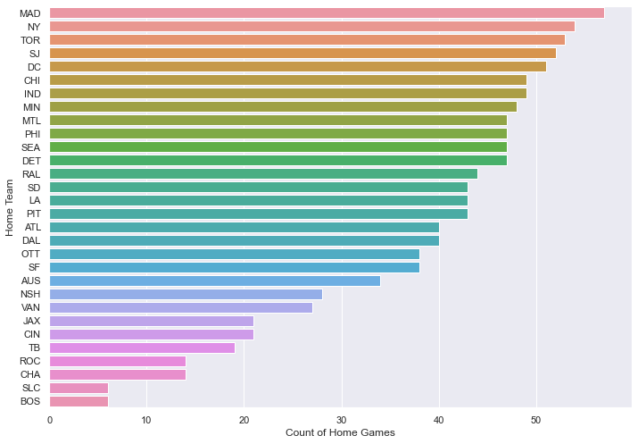
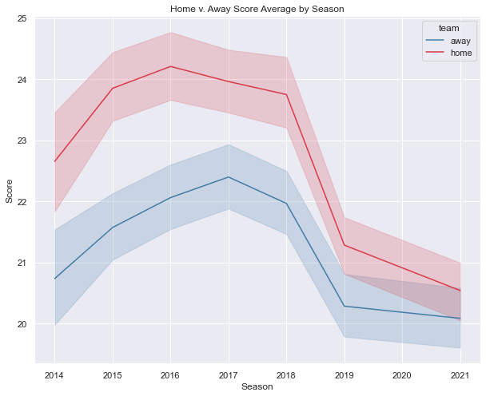
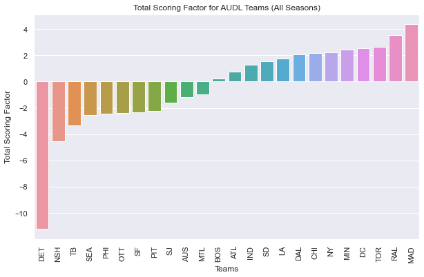
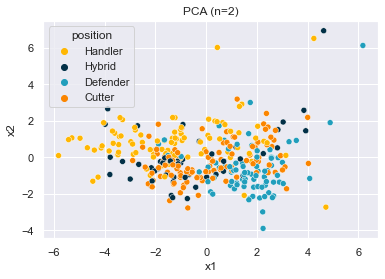

# **The American Ultimate Disc League**
The American Ultimate Disc League (AUDL) was created in 2012 to bring the sport of ultimate to the professional stage. The league originally started with 8 teams and has now grown to 25, spanning the US and Canada. Since the inaugural year, the league has collected data during their games on many key player and team attributes. This is a look into both player and team stats provided by the AUDL on their [website](https://theaudl.com/league/stats). The site provides All-time Player Stats, Single-season Team Stats, and Single-season Player Stats.

## ❔ Problem Statement
This analysis seeks to look at two separate problems:

1.  Does playing a game at home versus away give a team an advantage? If so, what kind of advantage and how much of an advantage?
- The "Home Court Advantage" is a well known phenomenon in team sports. When your friends and family are surrounding you, it can bolster teams to perform at a more peak level. In this project, I'll assess team performance in several categories, as well as player performance in several categories for a specific team (#CantStopWontStop) to see how playing at home versus away affects performance.

2. Can we effectively categorize players into sub-categories based on their player attributes?
- Within some player pages on the AUDL website, next to their team name players may have an on-field designation of 'Cutter', 'Handler', 'Defender', or 'Hybrid'. Of the ~2,700 players on the website, nearly 500 of these players have a designation. In this project, I'll test two separate classifiers (KNN and Decision Tree) in an attempt to determine if it's possible to properly classify players based on attributes such as goals, assists, points played, etc.

## 🔢 Data

Data was scraped from the AUDL website and saved to a series of CSV files. For Problem #1 (Home Field Advantage), I will use both team stats by season and player stats as a whole. For Problem #2 (Categorization), data was scraped from each player page. This data will be merged with each player's overall season stats for each season. One paired with these stats, the attributes will be normalized by points played to make sure players with the most playing time don't skew the data set.

For future work, it would be useful to identify players that have shifted roles across seasons. If a player changes from being primarily a Cutter in 2020, to primarily a Handler in 2021, they will likely be noted on the website as a Handler, but their 2020 stats may not reflect that.

## 📊 Results

### Problem 1: Home Court Advantage 🏠

Using data from 2014 through 2021 (excluding 2020 due to a lack of season), there is strong statistical evidence that playing at home provides considerable advantage for a team as compared to playing away. The data assessed over 1,000 AUDL games from the perspective of both the home and the away teams. The following image shows how many Home games each team played across the 7 seasons.

Long-standing teams such as the Madison Radicals (MAD) and the New York Empire (NY) have considerable impact on this study because they have been in the league since it's inauguration and have done fairly well. These teams are just two of many examples of teams that clearly perform better at home. The trend is continuous throughout all seasons analyzed, but the gap between scores of home teams and away teams appears to be closing.

Through the 2018 season, the difference between Average Home Score and Average Away Score was relatively consistent, with Home teams scoring 1.5-2 goals more than their counterparts. However, in the 2019 season something changed. One plausible reason is the change to the rule dictating when the clock is allowed to start for a point. The new rule instituted in 2019 allows the clock to start when a pull is released (rather than when it is caught). This extra time may lead to more Hail Mary passes at the end of games, especially by teams who are down by just 1-2 goals.

Although close in 2019, and even closer in 2021, the Home Team seems to consistently score more points on average. But this isn't the case for every team. The below chart shows the overall goal modification factor for each team (at both home and away games). For at least 

The higher the scoring factor, the more goals a team is expected to score against opponents, whether at home or away. The [Problem 1 Notebook](./P1%20-%20Home%20Field%20Advantage.ipynb) has the broken out Home and Away scoring factors for each team, indicating how many points they're expected to win/lose by when playing Home and Away games respectively.

Additionally, a study was done to see if there is statistical significance to the difference between how well teams scored at home versus away. In all cases except the 2021 season, we can say with significant certaintaty that there is indeed an advantage to playing at home versus playing away. The p-value for the 2021 season (~0.08) is too high to reject our null hypothesis at the decided significance. These results seem to echo what has been previously established

### Problem 2: Player Categorization 🎽

The AUDL website contains stats and player information for the more than 2,500 athletes that have played in the professional league. In addition to noting the number of assists, goals, huck percentage, etc., a select number of players have information on their position as shown below.

As shown above, Matt Smith of the Atlanta Hustle is listed as a 'Hybrid' meaning he can often be found both handling the disc and cutting for the disc on offense. Looking at the scraped data, the AUDL lists players as one of four 'positions':

1. Hybrid: Able to be both a cutter and a handler on offense
2. Cutter: An offensive cutter who makes athletic moves to advance the disc up the field
3. Handler: A player with great throwing skills who can throw to cutters
4. Defender: A player who works on defense to disrupt the other team's offensive flow

Unfortunately, of the 2,558 players on the website, only 474 players with an official listed position. With that information, is it possible to assess player stats to create a model for classifying players?

After performing Principle Component Analysis, some great segmentation of players was shown when projecting information into a 2D space.

This indicated promise for creating an effective model. Five models were created, trained, tuned, and tested. The F-1 score was used as the success metric. Below is how each Model performed on the test data (30%).

| model | f-1 score |
|-------|-----------|
| Decision Tree | 0.559944 |
| Random Forest | 0.60839 |
|  XGB  | 0.64336 |
|  KNN  | 0.67133   |

The KNN model performed best overal with 67%. The primary issue seen in all models was heavy overtraining. Many models performed 20%+ better on training data as compared to test data. Finally, an ensemble of the top 3 models was created to test if an ensemble might perform better. The ensemble model had an F-1 score 0f 0.59441, performing just below the Random Forest model.